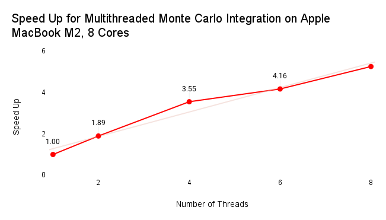
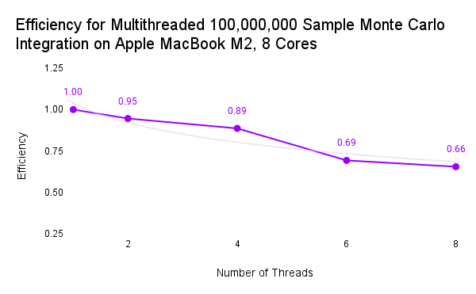

# Parallelized Numerical Integral Computation

CS 547 High Performance Computing @ Binghamton University

release date 2024-04-29 ([piazza](/))

## Submission
* Deadline:
  * 2024-05-06 11:59PM

Last working commit:
* [insert last commit before turning in assignment]

## Execution
Included within the repository is a [`Makefile`](/Makefile).

```shell
make && ./build/integrate [lower_bound] [upper_bound] [sample_size] [threads]
```

## Results

* Single runs, increasing sample size / thread count for each run
* Performance testing for done on MacBook M2 with 8 cores

### Speed Up Figure

Speed-up is defined by the computation time for 1 thread over the 
computation time for thread n. Increasing the number of threads has
a proportional relationship with the speed-up per execution run. 



### Efficiency Figure

Efficiency is defined by speed-up over the number of threads. 



A more detailed report can be found in [reports](report/)

## Source

* https://cs.binghamton.edu/~kchiu/cs447/assign/3/